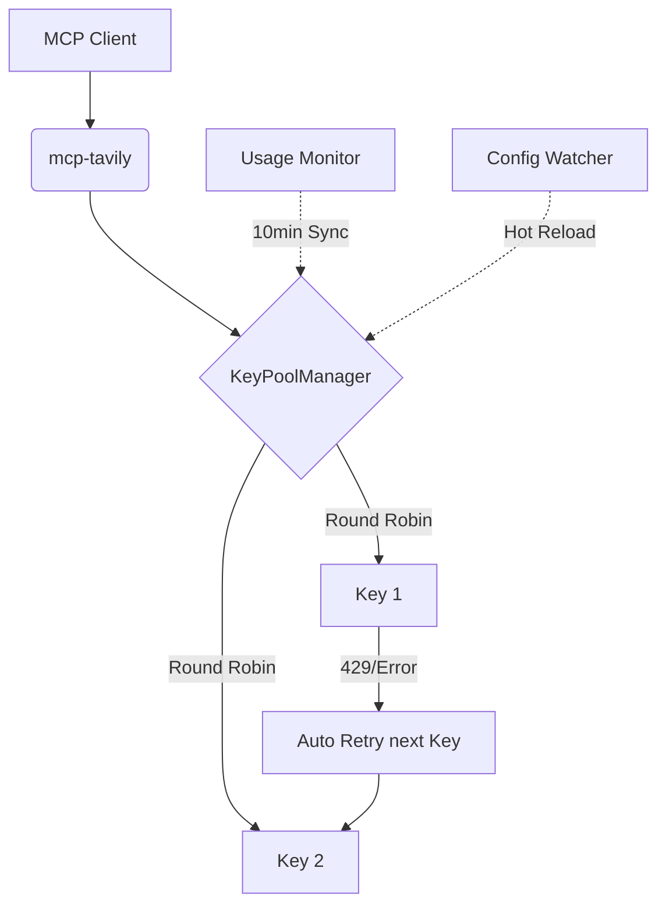

# mcp-tavily: 高配额、高可用的 Tavily MCP 聚合服务

| 版本号 | 日期       | 变更说明 | 作者       |
|--------|------------|----------|------------|
| v1.0.0 | 2026-04-06 | 初始版本：发布核心功能与 Docker 部署指南 | Gemini CLI |

`mcp-tavily` 是一个基于 Model Context Protocol (MCP) 的代理服务。它通过聚合多个 Tavily API Key，实现搜索配额的自动均衡与扩展，为 AI 模型提供更稳定、高配额的实时搜索能力，同时保持与 Tavily 官方 MCP 接口的 100% 兼容。

## ✨ 核心特性

- 🔄 **多 Key 聚合 (Round Robin):** 自动轮询调度多个 API Key，均衡负载。
- 🛡️ **工业级容错:** 自动捕获 429 (限流) 或 5xx 错误，并立即切换到下一个可用 Key 重试。
- ❄️ **冷却机制 (Cooldown):** 智能识别被限流的 Key 并进入冷却期，防止盲目重试。
- 📊 **主动配额监控:** 定期同步所有 Key 的 Usage 信息，实时熔断配额耗尽的 Key。
- 🔥 **热加载 (Hot Reload):** 监听 `.env` 文件变化，无需重启服务即可动态增删 API Key。
- 🤝 **官方兼容:** 工具接口与官方 `@tavily/mcp` 100% 对齐，无需修改客户端配置。

## 🚀 快速开始

### 1. 配置 API Key
复制模板文件并填写你的 Tavily API Key：
```bash
cp .env.example .env
```
编辑 `.env`：
```ini
# 多个 Key 用逗号分隔
TAVILY_API_KEYS=tvly-key1,tvly-key2,tvly-key3
```

### 2. 使用 Docker 部署 (推荐)
```bash
docker-compose up -d --build
```

### 3. 本地开发运行
确保已安装 Python 3.10+，并建议在虚拟环境中运行：
```bash
pip install -r requirements.txt
python app/main.py
```

## 🛠️ MCP 客户端集成

### 集成到 Cursor / Claude Desktop
在你的 MCP 配置文件（如 `mcp_config.json`）中添加以下配置：

```json
{
  "mcpServers": {
    "mcp-tavily": {
      "command": "docker",
      "args": [
        "exec",
        "-i",
        "mcp-tavily",
        "python",
        "app/main.py"
      ]
    }
  }
}
```
*注：如果你直接运行 Python 脚本，请将 command 改为 `python` 并指向绝对路径。*

## 📖 工具参考 (Tools)

本服务提供与官方完全一致的 4 个工具：

1.  **`tavily-search`**: 强大的网页搜索。支持 `search_depth`, `max_results` 等。
2.  **`tavily-extract`**: 网页内容提取。从 URL 获取干净的正文。
3.  **`tavily-crawl`**: 网站深度爬取。递归获取站点内容。
4.  **`tavily-map`**: 站点结构地图。发现网站的所有可用链接。

## 🧩 架构简图



## 📅 后续规划
- [ ] 动态权重调度（根据剩余配额分配权重）。
- [ ] 导出 Key 消耗报表。
- [ ] 支持通过 MCP Tool 动态添加 Key。

## 📄 开源协议
[MIT License](LICENSE)
