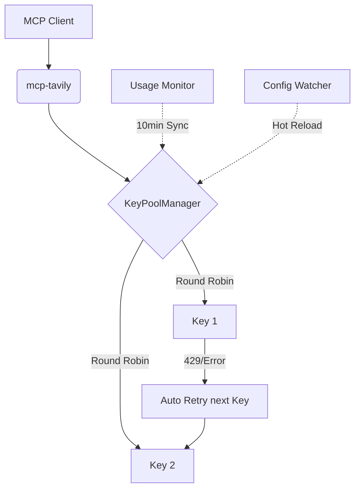

# mcp-tavily: 高配额、高可用的 Tavily MCP 聚合服务

| 版本号 | 日期       | 变更说明 | 作者       |
|--------|------------|----------|------------|
| v1.0.0 | 2026-04-06 | 初始版本：发布核心功能与 Docker 部署指南 | Gemini CLI |

`mcp-tavily` 是一个基于 Model Context Protocol (MCP) 的代理服务。它通过聚合多个 Tavily API Key，实现搜索配额的自动均衡与扩展，为 AI 模型提供更稳定、高配额的实时搜索能力，同时保持与 Tavily 官方 MCP 接口的 100% 兼容。

## ✨ 核心特性

- 🔄 **多 Key 聚合 (Round Robin):** 自动轮询调度多个 API Key，均衡负载。
- 🛡️ **工业级容错:** 自动捕获 429 (限流) 或 5xx 错误，并立即切换到下一个可用 Key 重试。
- ❄️ **冷却机制 (Cooldown):** 智能识别被限流的 Key 并进入冷却期，防止盲目重试。
- 📊 **主动配额监控:** 定期同步所有 Key 的 Usage 信息，实时熔断配额耗尽的 Key。
- 🔥 **热加载 (Hot Reload):** 监听 `.env` 文件变化，无需重启服务即可动态增删 API Key。
- 🤝 **官方兼容:** 工具接口与官方 `@tavily/mcp` 100% 对齐，无需修改客户端配置。

## 🚀 快速开始

### 1. 配置 API Key
复制模板文件并填写你的 Tavily API Key：
```bash
cp .env.example .env
```
编辑 `.env`：
```ini
# 多个 Key 用逗号分隔
TAVILY_API_KEYS=tvly-key1,tvly-key2,tvly-key3
```

### 2. 使用 Docker 部署 (推荐)
```bash
docker-compose up -d --build
```

### 3. 本地开发运行
确保已安装 Python 3.10+，并建议在虚拟环境中运行：
```bash
pip install -r requirements.txt
python app/main.py
```

## 🛠️ MCP 客户端集成

本服务仅通过 **Streamable HTTP** 协议提供 MCP 接口（不支持 stdio / SSE），默认监听地址为
`http://<host>:8000/mcp`（可通过 `MCP_HOST` / `PORT` / `MCP_PATH` 环境变量调整）。

### 集成到 Cursor / Claude Desktop 等支持 HTTP 的客户端
在你的 MCP 配置文件（如 `mcp_config.json`）中添加以下配置：

```json
{
  "mcpServers": {
    "mcp-tavily": {
      "url": "http://127.0.0.1:18000/mcp",
      "transport": "streamable-http"
    }
  }
}
```
*注：使用 `docker-compose up -d --build` 部署时，端口映射为宿主机 `18000` → 容器内 `8000`；
本地直接运行 `python app/main.py` 时请改用 `http://127.0.0.1:8000/mcp`。*

## 📖 工具参考 (Tools)

本服务提供与官方完全一致的 4 个工具：

1.  **`tavily-search`**: 强大的网页搜索。支持 `search_depth`, `max_results` 等。
2.  **`tavily-extract`**: 网页内容提取。从 URL 获取干净的正文。
3.  **`tavily-crawl`**: 网站深度爬取。递归获取站点内容。
4.  **`tavily-map`**: 站点结构地图。发现网站的所有可用链接。

### 工具参数速查

> 与官方 `@tavily/mcp` 保持 1:1 对齐，参数定义硬编码于 `app/constants/tools.py`。
> 标 * 的为可选参数。

| 工具 | 参数 | 类型 | 默认值 | 说明 |
|------|------|------|--------|------|
| `tavily-search` | `query` | string | — | 搜索查询语句（必填） |
|  | `search_depth` * | enum: `basic` \| `advanced` | `basic` | 搜索深度 |
|  | `topic` * | enum: `general` \| `news` \| `finance` | `general` | 搜索主题类别 |
|  | `days` * | number | — | 仅 `topic=news` 时生效 |
|  | `max_results` * | number | `5` | 上限 20 |
|  | `include_images` * | bool | `false` | 是否在结果中包含图片 |
|  | `include_answer` * | bool | `false` | 是否包含 AI 简答 |
|  | `include_raw_content` * | bool | `false` | 是否包含原始 HTML |
|  | `include_domains` * | string[] | — | 限定域名白名单 |
|  | `exclude_domains` * | string[] | — | 限定域名黑名单 |
|  | `time_range` * | enum: `day` \| `week` \| `month` \| `year` | — | 时间范围 |
|  | `include_image_descriptions` * | bool | `false` | 是否包含图片文字描述 |
| `tavily-extract` | `urls` | string[] | — | 要提取的 URL 列表（必填） |
|  | `extract_depth` * | enum: `basic` \| `advanced` | `basic` | 提取深度 |
|  | `include_images` * | bool | `false` | 是否提取图片链接 |
| `tavily-crawl` | `url` | string | — | 起始 URL（必填） |
|  | `max_depth` * | number | — | 最大深度 |
|  | `max_breadth` * | number | — | 每层最多跟随的链接数 |
|  | `limit` * | number | — | 总链接数上限 |
|  | `instructions` * | string | — | 给爬虫的自然语言指令 |
|  | `select_paths` * | string[] | — | 包含的路径模式（Regex） |
|  | `exclude_paths` * | string[] | — | 排除的路径模式（Regex） |
|  | `include_images` * | bool | `false` | 是否包含图片 |
|  | `allow_external` * | bool | `false` | 是否允许爬取外部域名 |
| `tavily-map` | `url` | string | — | 起始 URL（必填） |
|  | `max_depth` * | number | — | 映射深度 |
|  | `limit` * | number | — | URL 数量上限 |
|  | `select_paths` * | string[] | — | 路径过滤 |

## 🧩 架构简图



## 📅 后续规划
- [ ] 动态权重调度（根据剩余配额分配权重）。
- [ ] 导出 Key 消耗报表。
- [ ] 支持通过 MCP Tool 动态添加 Key。

## ⚙️ 完整环境变量

| 变量 | 必填 | 默认值 | 说明 |
|------|------|--------|------|
| `TAVILY_API_KEYS` | ✅ | — | 多个 Tavily Key 用英文逗号分隔；空值时服务 fail-fast 退出 |
| `LOG_LEVEL` | ❌ | `INFO` | 取值 `INFO` / `DEBUG` / `WARNING` / `ERROR`，由 `app/utils/logger.py` 读取并应用到根 Logger |
| `MCP_HOST` | ❌ | `0.0.0.0` | Streamable HTTP 监听地址 |
| `PORT` | ❌ | `8000` | 监听端口；Docker 部署时宿主机侧为 `18000`（`docker-compose.yml` 已映射 `18000→8000`） |
| `MCP_PATH` | ❌ | `/mcp` | MCP 接入路径 |
| `MONITOR_INTERVAL` | ❌ | `10` | ⚠️ **当前实现硬编码为 10 分钟**，该环境变量在 `.env.example` 中列出但代码未读取（参见 `app/tasks/monitor.py::monitor_usage_task`） |

## 🧪 测试

```bash
# 仓库提供 5 个测试文件、26+ 用例
pytest tests/

# 单文件运行
pytest tests/test_transport.py -v
pytest tests/test_integration.py -v
```

测试覆盖：传输协议配置、Round Robin + 429 重试、Usage 监控鉴权、Key 状态机（含并发死锁回归）、日志 Handler 挂载位置。

## 🏥 健康检查 / 端点探测

服务启动后，可用以下命令做最小化探活（无需 Tavily Key）：

```bash
curl -s -X POST http://127.0.0.1:8000/mcp \
  -H "Content-Type: application/json" \
  -H "Accept: application/json, text/event-stream" \
  -d '{"jsonrpc":"2.0","id":1,"method":"initialize","params":{"protocolVersion":"2025-03-26","capabilities":{},"clientInfo":{"name":"probe","version":"1.0"}}}'
```

正常响应形如（截取关键字段）：

```json
{"jsonrpc":"2.0","id":1,"result":{"serverInfo":{"name":"mcp-tavily","version":"<见 serverInfo>"}}}
```

> 💡 这一步等价于 `claude mcp list` 在 HTTP 端点上做"探活"。`/mcp` 走 Streamable HTTP 协议，
> 单连接同时支持 `initialize` / `tools/list` / `tools/call` 等 MCP 标准方法。

## ⚠️ 已知限制

- **传输协议**：仅支持 Streamable HTTP（`transport="streamable-http"`），**不提供** stdio 或 SSE。
  接入时 MCP 客户端必须用 `url` 配置而非 `command` 子进程方式。
- **鉴权**：服务自身不实现鉴权 / OAuth / API Key，部署时请依赖网络层隔离（仅监听内网、
  上游反向代理加 IP 白名单等）。
- **MONITOR_INTERVAL**：环境变量在 `.env.example` 中列出但**当前未实现**读取逻辑，监控周期
  硬编码为 10 分钟。如需变更请直接修改 `app/tasks/monitor.py::monitor_usage_task` 的默认值。
- **Python 版本**：容器内使用 `python:3.12-slim`（见 `Dockerfile`）；本地开发建议使用
  `/media/data/venv` 虚拟环境（与项目约定一致）。
- **官方接口对齐**：工具的 `name` / `description` / `inputSchema` 硬编码在 `app/constants/tools.py`，
  对齐官方 `@tavily/mcp` v0.2.4+。定期审计脚本 `scripts/sync_schemas.py` 当前**尚未实现**，
  缺口已记录于 `TODO.md`。

## 🔍 Key 失效日志格式（v3.4.4+）

服务会在三种"Key 失效"事件发生时写入**带位置 + 末 6 位脱敏**的日志，便于你在 `.env` 中
快速定位是哪个 Key 出问题：

| 事件 | 触发条件 | 日志级别 | 日志样例 |
|------|----------|----------|----------|
| 401 鉴权失败 | `str(e)` 含 `401` / `unauthorized` / `invalid` | `ERROR` | `[Key失效] 第 3 个 Key（尾号 xyz123）鉴权失败，已标记为 ERROR。原始错误: HTTP 401: Unauthorized` |
| 配额耗尽 | Usage API 返回 `usage >= limit > 0` | `ERROR` | `[Key失效] 第 1 个 Key（尾号 abcdEF）配额耗尽 (1000/1000)，已标记为 EXHAUSTED` |
| 限流冷却 | `str(e)` 含 `429` / `rate limit` | `WARNING` | `[Key限流] 第 2 个 Key（尾号 7g8h9i）触发限流，进入 60s 冷却。原始错误: HTTP 429: Rate Limit Exceeded` |
| 配额查询 401 | Usage API 返回 401 | `ERROR` | `[Key失效] 第 4 个 Key（尾号 qwerty）使用情况查询返回 401（鉴权失败）。原始错误: Invalid API Key` |

**关键设计点**：

- **位置（"第 N 个 Key"）**：来自 `Key.position` 字段，1-based，由 `ConfigManager` 在解析
  `.env` 时分配。`.env` 改动后**自动重新分配**（热加载会调用 `update_keys`）。
- **尾号（末 6 位）**：与 `_mask_key` 的"前 4...后 4"格式不同；这里**只暴露末 6 位**以避免
  反向推断完整 Key。脱敏的"信息熵"足够让你在 `.env` 里人肉对位但不足以恢复原 Key。
- **配额耗尽日志仅打一次**：状态由非 EXHAUSTED 变为 EXHAUSTED 时打一行；后续轮询若仍
  EXHAUSTED 不会刷屏。回归测试见 `tests/test_monitor.py::test_exhausted_log_emitted_only_on_transition`。

## 📚 相关文档

- 架构概览：[`docs/design/ARCH_OVERVIEW.md`](docs/design/ARCH_OVERVIEW.md)
- 需求文档：[`docs/requirements/PRD.md`](docs/requirements/PRD.md)
- 待办与缺口：[`TODO.md`](TODO.md)

## 📄 开源协议
[MIT License](LICENSE)
