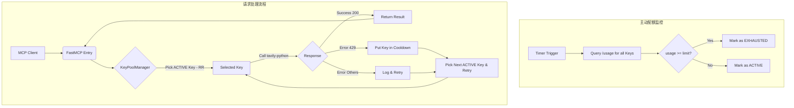

# Product Requirements Document (PRD) - mcp-tavily

| 版本号 | 日期       | 变更说明 | 作者       |
|--------|------------|----------|------------|
| v1.4.0 | 2026-07-22 | 明确传输协议要求为 Streamable HTTP，移除 stdio/SSE 支持 | Copilot |
| v1.3.0 | 2026-04-06 | 补充 Tool 描述同步策略 (Hardcoded Alignment) | Gemini CLI |
| v1.2.0 | 2026-04-06 | 补充主动 Usage 检查、tavily-python 库集成 | Gemini CLI |
| v1.1.0 | 2026-04-06 | 补充 Round Robin, 重试及 Cooldown 机制 | Gemini CLI |
| v1.0.0 | 2026-04-06 | 初始版本 | Gemini CLI |

## 1. 项目愿景 (Vision)
`mcp-tavily` 是一个基于 Model Context Protocol (MCP) 的代理服务。它通过聚合多个 Tavily API Key，实现搜索配额的自动均衡与扩展，为 AI 模型提供更稳定、高配额的实时搜索能力，同时保持与 Tavily 官方 MCP 接口的 100% 兼容。

## 2. 核心需求 (Core Requirements)

### 2.1 API Key 聚合与配额管理
- **多 Key 聚合:** 支持配置多个 Tavily API Key。
- **调度策略 (Round Robin):** 系统采用 **Round Robin (轮询)** 算法分配请求。
- **错误重试逻辑:** 当当前选中的 Key 回复失败（5xx、超时、429）时，自动切换到下一个 Key 并立即重试。
- **冷却机制 (Cooldown):** 
  - 当某个 Key 返回 429 错误时，将其标记为“冷却中”状态，并在一定时长内暂停调度。
- **主动配额监控 (Usage Check):**
  - **接口调用:** 系统必须定期调用 [Tavily Usage API](https://docs.tavily.com/documentation/api-reference/endpoint/usage) 获取每个 Key 的使用详情。
  - **主动熔断:** 如果查询结果显示 `usage >= limit`，该 Key 必须被标记为“配额已耗尽 (EXHAUSTED)”并立即移出活跃调度池。
  - **定期同步:** 系统应每隔固定时间（如 10 分钟）同步一次所有 Key 的使用情况，以应对外部消耗。

### 2.2 技术栈要求
- **核心框架:** 使用 `FastMCP` (Python SDK)。
- **传输协议:** 仅使用 **Streamable HTTP**（`transport="streamable-http"`），不提供 stdio 或 SSE
  传输方式；监听地址/端口/路径通过 `MCP_HOST` / `PORT` / `MCP_PATH` 环境变量配置（默认
  `0.0.0.0:8000/mcp`）。
- **API 交互:** 
  - 搜索/提取功能使用官方 `tavily-python` 库实现。
  - 监控功能直接调用 Tavily REST API (使用 `httpx`)。
- **运行时:** Python 3.10+，使用 `/media/data/venv` 环境。

### 2.3 接口兼容性 (工具描述同步策略)
- **目标:** 提供与 Tavily 官方 MCP 完全一致的工具接口。
- **描述同步策略 (Tool Description Policy):**
  - **静态对齐 (Static Alignment):** 为了保证启动性能和离线稳定性，项目应将官方 Tool 的 `name`, `description` 和 `inputSchema` 硬编码在代码常量中。
  - **完全一致性:** 描述文字必须与官方版本（如 v0.2.4+）逐字对应，确保在 MCP Client (如 Claude, Cursor) 中的展示效果完全一致。
  - **定期审计:** 在 CI/CD 流程或 README 中提供审计脚本，定期对比官方 `npx @tavily/mcp` 的输出，确保定义不陈旧。
- **工具定义:** `tavily_search`, `tavily_extract`, `tavily_crawl`, `tavily_map`。

### 2.4 部署规范
- **容器化:** 编写 `Dockerfile` 及 `docker-compose.yml`。
- **日志轮转:** 实现日志文件的按天或按大小轮转。
  > ℹ️ **当前实现状态（2026-07-22 同步）**: 仅按大小轮转，由 `app/utils/logger.py` 的
  > `RotatingFileHandler(maxBytes=5MB, backupCount=5)` 实现；**按天轮转尚未实现**，
  > 缺口已记录于 `TODO.md`。

## 3. 业务逻辑流程 (Business Flow)



## 4. 目录结构规范
```text
/
├── app/
│   ├── __init__.py
│   ├── main.py          # FastMCP 入口
│   ├── constants/
│   │   └── tools.py     # 硬编码的官方工具描述与 Schema
│   ├── core/
│   │   ├── manager.py   # KeyPoolManager (Round Robin + Cooldown + Usage Monitoring)
│   │   └── key.py       # Key 实体 (含状态控制)
│   ├── tasks/
│   │   └── monitor.py   # 定期 Usage 检查后台任务
│   └── utils/
│       └── logger.py    # 带轮转功能的日志
├── scripts/
│   └── sync_schemas.py  # 用于从官方 MCP 获取定义的脚本
├── docs/
├── tests/
├── Dockerfile
└── docker-compose.yml
```

> ⚠️ **目录结构与代码同步状态（2026-07-22）**:
> - `app/`, `tests/`, `docs/`, `Dockerfile`, `docker-compose.yml` 均已存在。
> - `scripts/sync_schemas.py` **暂未实现**，与 PRD §2.3 的"定期审计"要求存在差距，缺口已记录于 `TODO.md`。

## 5. 后续规划
- 支持动态添加/删除 API Key。
  > ✅ **已于 v1.1.0 实现**: `app/core/config.py` 的 `ConfigManager` 监听 `.env` 文件变更
  > （默认 5 秒间隔），调用 `KeyPoolManager.update_keys()` 完成热替换，无需重启服务。
  > 本条目保留作为 PRD 历史规划记录。
- 增加监控仪表盘。
